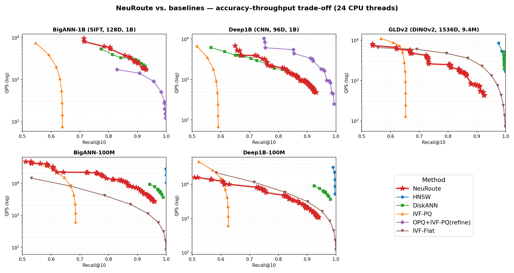
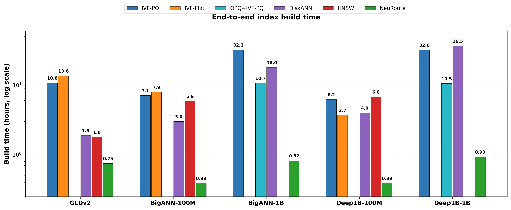

# NeuRoute: Logit-Guided Neural Routing for Billion-Scale Vector Search with Sub-Hour Index Construction

[](LICENSE)
[](paper/NeuRoute_arXiv.pdf)

Official implementation and artifact release for **NeuRoute**, a learned hashing index that turns short binary codes into an effective routing primitive for billion-scale approximate nearest neighbor (ANN) search.

> **NeuRoute: Logit-Guided Neural Routing for Billion-Scale Vector Search with Sub-Hour Index Construction**  
> Xingqiao Wang, Zi Wang, Xiaowei Xu  
> University of Arkansas at Little Rock

[Paper](paper/NeuRoute_arXiv.pdf) | [Appendix](paper/Appendix.pdf) | [Overleaf source](paper/overleaf/) | [Results](results/)





## Highlights

- **Sub-hour billion-scale indexing.** End-to-end training plus index construction completes in 0.82 h on BigANN-1B and 0.93 h on Deep1B-1B on a single machine.
- **Logit-guided routing.** Encoder logits serve as an uncertainty signal: deviation-to-threshold scores prioritize uncertain-bit perturbations for query-adaptive multi-bucket probing.
- **Bucket-local clustering.** Lightweight clustering inside learned hash buckets creates a centroid stage that reduces exact-refinement work at high recall.
- **Strong accuracy-throughput trade-off.** On BigANN-1B, NeuRoute reaches 90.3% Recall@10 at 2,414 QPS, 1.7x faster than OPQ+IVF-PQ with refinement at comparable accuracy.

## What Is Included

This release contains the pieces needed to inspect, reproduce, and extend the paper artifacts:

- `src/`: Python training, model selection, encoding, CSR index construction, calibration, and dataset-specific entry points.
- `cpp/`: C++ bucket-local clustering and query-time retrieval pipeline with TorchScript, OpenMP, and vectorized distance kernels.
- `results/`: measured Recall@10-QPS sweeps for NeuRoute and baselines, build-time CSVs, and publication figures.
- `paper/`: arXiv/preprint PDF, appendix PDF, and the Overleaf source bundle used for the manuscript.
- `scripts/`: lightweight plotting helpers for release figures.

> Naming note: `AutoHash` and `SPHash` are historical internal names that remain in some source paths, configs, and paper-source filenames. The paper-facing system name is **NeuRoute**.

## Repository Structure

```text
NeuRoute/
|-- paper/
|   |-- NeuRoute_arXiv.pdf
|   |-- Appendix.pdf
|   `-- overleaf/                         # LaTeX source and paper figures
|-- src/                                  # Python training and index construction
|   |-- SPHash_base.py                    # Core framework: training, model selection, CSR build
|   |-- indexing_model_base.py            # Base encoder architecture
|   |-- AutoHash_bigann_eu.py             # BigANN-1B entry point
|   |-- AutoHash_bigann_eu_100m.py        # BigANN-100M entry point
|   |-- AutoHash_deep1b_eu.py             # Deep1B entry point
|   |-- AutoHash_deep1b_eu_100m.py        # Deep1B-100M entry point
|   |-- AutoHash_image_eu.py              # GLDv2 entry point
|   |-- Bigann/ Deep1b/ GLDv2/            # Dataset-specific helpers
|   |-- retrieval/                        # C++ pipeline config generation
|   `-- utils/                            # CSR builders, config generation, tools
|-- cpp/
|   |-- bucket_cluster/                   # Bucket-local clustering
|   `-- query_pipeline/                   # Query-time benchmark
|-- results/
|   |-- figures/                          # Recall-QPS and build-time figures
|   |-- build_time.csv                    # Build-time comparison values
|   |-- neuroute_build_breakdown.csv      # NeuRoute stage-level build breakdown
|   |-- bigann-1b/ deep1b-1b/
|   |-- bigann-100m/ deep1b-100m/
|   `-- gldv2/
|-- scripts/
|   `-- plot_build_time.py
`-- requirements.txt
```

## Requirements

Python training and preprocessing:

```bash
pip install -r requirements.txt
```

Expected Python stack:

- Python 3.10 or newer
- PyTorch 2.0 or newer, with CUDA recommended for encoder training
- NumPy, Numba, tqdm, Matplotlib

C++ retrieval and clustering:

- GCC 11 or newer with C++17
- CMake 3.18 or newer
- OpenMP
- CPU with AVX2/FMA
- libtorch, reused from the active PyTorch environment
- FAISS for `cpp/bucket_cluster`

## Datasets

| Dataset | Type | Dim | Size | Source |
|---|---:|---:|---:|---|
| BigANN-1B / 100M | SIFT | 128 uint8 | 1B / 100M | [big-ann-benchmarks](https://big-ann-benchmarks.com/) |
| Deep1B / 100M | CNN features | 96 float32 | 1B / 100M | [big-ann-benchmarks](https://big-ann-benchmarks.com/) |
| GLDv2 augmented | DINOv2 image embeddings | 1536 float32 | 9.39M | [Google Landmarks v2](https://github.com/cvdfoundation/google-landmark) |

Download base, query, and ground-truth files following the dataset providers. Then edit the `/path/to/...` placeholders in the entry scripts under `src/AutoHash_*.py`. Helpers in `src/Bigann/data_preprocessing.py` and `src/Deep1b/data_format_transfer.py` convert `.u8bin` and `.fbin` files to the expected local formats.

## End-to-End Pipeline

### 1. Train encoder and select model

```bash
cd src
python AutoHash_bigann_eu.py
```

The entry script trains candidate encoders, selects the best configuration with `compare_models_from_config`, and writes the selected model plus thresholds into `Autohash_config.json`.

### 2. Build the CSR index

`build_index` in the entry script encodes the base vectors and materializes the bucket-level CSR index. Bucket-local clustering uses the C++ clustering binary:

```bash
g++ -O3 -march=native -fopenmp -std=c++17 \
  cpp/bucket_cluster/bucket_cluster_pipeline_v6_8_1_gt.cpp \
  -lfaiss -o bucket_cluster_pipeline
```

`prepare_cpp_inputs_and_run` and `build_subcodes_from_next_dir` stage the encoded vectors, run bucket-local clustering, and emit the sub-CSR structures consumed by the query pipeline. Fast local storage such as `/dev/shm` is recommended for staging.

### 3. Compile the query benchmark

```bash
cd cpp/query_pipeline
conda activate <env-with-pytorch>
bash cmake.sh
```

### 4. Run retrieval

```bash
cp cfg.example.json cfg.json
./build/bench_enum_centroid_stage_only_v6_8_aligned cfg.json
```

Key configuration fields:

| Field | Meaning |
|---|---|
| `csr_base_dir`, `subcsr_*` | CSR index files from index construction |
| `torch_model_path` | TorchScript encoder from training |
| `query_path`, `gt_i64_bin`, `gt_K` | Query and ground-truth files |
| `metric` | `l2_u8_128`, `l2_f32_96`, or `ip1536` |
| `D`, `D_in` | Code length and input dimensionality |
| `Lsel`, `Rmax`, `max_score` | Bucket-enumeration budget |
| `big_topm`, `phase2_vec_budget` | Centroid gating and refinement budget |
| `omp_threads` | Search threads, 24 in the paper |

The benchmark reports QPS, mean latency, p99.9 latency, and Recall@K over the configured sweep.

## Results

NeuRoute operating points at Recall@10 >= 0.90:

| Dataset | Best QPS @ Recall@10 >= 0.90 | Max Recall@10 | NeuRoute build time |
|---|---:|---:|---:|
| BigANN-1B | 2,414 | 0.930 | 0.82 h |
| Deep1B-1B | 842 | 0.931 | 0.93 h |
| BigANN-100M | 6,971 | 0.959 | 0.39 h |
| Deep1B-100M | 2,001 | 0.940 | 0.39 h |
| GLDv2 | 771 | 0.927 | 0.75 h |

NeuRoute build-time breakdown:

| Dataset | Train (s) | Index build (s) | CSR build (s) | Clustering (s) | Add/Build (s) | Total |
|---|---:|---:|---:|---:|---:|---:|
| BigANN-100M | 1197.56 | 49.96 | 40.78 | 43.00 | 187.00 | 1384.56 s / 0.39 h |
| Deep1B-100M | 1176.27 | 41.85 | 64.44 | 69.00 | 229.00 | 1405.27 s / 0.39 h |
| BigANN-1B | 1183.46 | 529.29 | 420.50 | 380.00 | 1772.00 | 2955.47 s / 0.82 h |
| Deep1B-1B | 1124.43 | 368.00 | 903.36 | 614.00 | 2212.00 | 3336.43 s / 0.93 h |
| GLDv2 | 2471.15 | 84.78 | 51.27 | 44.00 | 237.00 | 2708.15 s / 0.75 h |

Full sweeps are stored in `results/`, one directory per dataset and one CSV per method. Baselines include FAISS HNSW, IVF-Flat, IVF-PQ, OPQ+IVF-PQ with refinement, and DiskANN. DiskANN CSV recall columns are percentages from 0 to 100; other CSVs use fractions from 0 to 1.

To regenerate the build-time figure:

```bash
python scripts/plot_build_time.py
```

## Citation

```bibtex
@article{wang2026neuroute,
  title   = {NeuRoute: Logit-Guided Neural Routing for Billion-Scale Vector Search with Sub-Hour Index Construction},
  author  = {Wang, Xingqiao and Wang, Zi and Xu, Xiaowei},
  journal = {arXiv preprint},
  year    = {2026}
}
```

## License

This project is released under the [MIT License](LICENSE).
